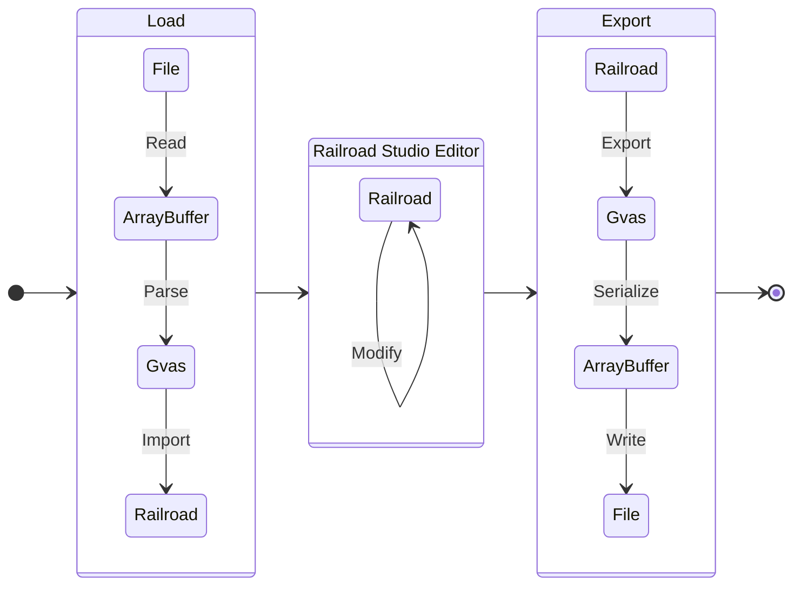

# Railroad Studio

This repository contains the source code for [railroad.studio](https://railroad.studio/).

## About

Railroad Studio is a static HTML, JavaScript and CSS webpage used to view and modify save files for Railroads Online.

## Editing save files

Most of the data contained within a .sav file can be modified through the studio
interface, by clicking the tabs across the top of the page. The industry editor
can be used to modify industry type, location, orientation, input and output
quantities. The player editor can be used to change money and xp. The Spline
Track editor allows editing any of the properties of the newest spline system.

When any property is modified, Railroad Studio will set a flag indicating that
there are unsaved edits to the save file. This will cause web browsers to notify
users before navigating away from the page, and make the export button yellow.

## Editing save files (advanced)

While many things are exposed through the Studio Editor interface, there are
some things where the interface to edit these values does not exist. For
situations where you want to edit something that is not exposed through a
graphical editor, it is possible to use console commands to edit anything stored
within a .sav file by loading that file in to Railroad Studio, modifying the
`window.studio.railroad` object, and then exporting the file. It may be helpful
to call functions which update the user interface, such as
`window.studio.setMapModified()`, and `window.studio.map.refreshSplines()`.

The following commands can be pasted into the browser's JavaScript console.
Note that these commands will only work after loading a save file:

#### Delete all rolling stock except Betsy

```js
betsy = window.studio.railroad.frames.find((f) => f.name === 'betsy');
window.studio.railroad.frames = [betsy];
window.studio.setMapModified();
```

#### Reset all players money and experience

```js
window.studio.railroad.players.forEach((p) => {
    p.xp = 0;
    p.money = 2000;
});
window.studio.setMapModified();
```

#### Delete all old splines

```js
window.studio.railroad.splines = []; // Catmull-rom tracks (old spline system)
window.studio.railroad.switches = []; // Switch objects (old spline system)
window.studio.setMapModified();
window.studio.map.refreshSplines(); // Update the map view
```

## Development

### Requirements

The build script uses the node package manager `npm` to manage build dependencies. See [Downloading and installing npm](https://docs.npmjs.com/downloading-and-installing-node-js-and-npm) for more information about how to configure npm for your platform.

Once installed, run `npm install` to install the necessary node package dependencies.

### Building

Run `npm start` to start the webpack-dev-server.

### Testing

Navigate to [http://localhost:8080/](http://localhost:8080/) to perform testing.

### Debugging

Source mappings are created, so you can use the web browser's native debugger.

### Releasing

To generate a minified `studio.js` for release, run `npm run build:prod`.

## Architecture

### Overview


The main entry point for the application is `ts/index.ts`. This file contains
the logic for the front page of Railroad Studio, which presents the user with a
file input box and instructions for locating the game .sav file.



### Reading files

When the user provides a .sav file in to the form input field, index.ts maps the
file into memory using an `ArrayBuffer`, and then calls out to other areas of
the code to parse and import the file:

1. The `ArrayBuffer` is _parsed_ into a `Gvas`.
2. The `Gvas` object is _imported_ into a `Railroad`.
3. The `Railroad` object is used to construct a `Studio`.

```ts
const gvas = parseGvas(buffer);
const railroad = gvasToRailroad(gvas);
window.studio = new Studio(railroad, ...);
```

From this point, the `Studio` object takes on the responsibility of presenting
the user with the full Railroad Studio interface. It delegates the
responsibility of the map rendering to the `RailroadMap` class, which lives
inside of the Map tab of the Studio. Other tabs include the frame editor, the
industry editor, and others.

### Exporting files

When exporting a `Railroad` object, the process of importing is reversed:

1. The `Railroad` object is _exported_ to a `Gvas`.
2. The `Gvas` object is _serialized_ to a `Blob`.
3. The `Blob` is converted to a URL that can be downloaded by the web browser.

```ts
const gvas = railroadToGvas(this.railroad);
const blob = gvasToBlob(gvas);
const url = URL.createObjectURL(blob);
```

## Types

### ArrayBuffer

The [`ArrayBuffer`](https://developer.mozilla.org/en-US/docs/Web/JavaScript/Reference/Global_Objects/ArrayBuffer)
object is used to represent a generic, fixed-length raw binary data buffer.
This is a good fit for RO save files, which are typically smaller than 300kb,
and a maximum observed size under 3MB.

### Blob

[`Blob`s](https://developer.mozilla.org/en-US/docs/Web/API/Blob) can represent
data that isn't necessarily in a JavaScript-native format. The File interface is
based on Blob, inheriting blob functionality and expanding it to support files
on the user's system.

### GvasString

One of the foundational types that is used throughout this repository is the
`GvasString`. This is used to represent GVAS binary strings, and is equivalent
to `string | null`. When reading and writing GVAS files, there are three binary
formats, depending on whether the string is null, ASCII or Unicode:

```
Format: null
(u32) length (0)

Format: ASCII (no characters >127)
(u32) positive length
(u8*) ascii string (null-terminated)

Format: Unicode
(u32)  negative length
(u16*) utf-16 encoded string (null-terminated)

Example: null
00 00 00 00

Example: ASCII ""
01 00 00 00 00

Example: ASCII "StrProperty"
0c 00 00 00 53 74 72 50 72 6f 70 65 72 74 79 00

Example: Unicode "§"
fe ff ff ff a7 00 00 00
```

### Gvas

The `Gvas` interface is a low level abstraction of the GVAS format, an Unreal
Engine format for rapidly serializing game state. Files in this format contain a
header, followed by a map of named properties. Each property has a property name
string, a property type, and a value.

The type can be a simple type such as a `['StrProperty']`, which represents a
single string value, an array such as `['ArrayProperty', 'BoolProperty']`, which
represents an array of booleans, or a complex type such as
`['ArrayProperty', 'StructProperty', 'Vector']`, which represents an array of
Vector structs. Note that while the GVAS format itself supports many different
combinations of types, only the ones used by Railroads Online are implemented.

```ts
type GvasTypes =
    | ['ArrayProperty', 'BoolProperty']
    | ['ArrayProperty', 'ByteProperty']
    | ['ArrayProperty', 'EnumProperty']
    | ['ArrayProperty', 'FloatProperty']
    | ['ArrayProperty', 'IntProperty']
    | ['ArrayProperty', 'NameProperty']
    | ['ArrayProperty', 'StrProperty']
    | ['ArrayProperty', 'StructProperty', 'Rotator']
    | ['ArrayProperty', 'StructProperty', 'Transform']
    | ['ArrayProperty', 'StructProperty', 'Vector']
    | ['ArrayProperty', 'TextProperty']
    | ['BoolProperty']
    | ['FloatProperty']
    | ['IntProperty']
    | ['NameProperty']
    | ['StrProperty']
    | ['StructProperty', 'DateTime']
    | [];

interface Gvas {
    _header: GvasHeader;
    _order: string[];
    boolArrays: Record<string, boolean[]>;
    bools: Record<string, boolean>;
    byteArrays: Record<string, number[]>;
    dateTimes: Record<string, bigint>;
    enumArrays: Record<string, GvasString[]>;
    floatArrays: Record<string, number[]>;
    floats: Record<string, number>;
    intArrays: Record<string, number[]>;
    ints: Record<string, number>;
    nameArrays: Record<string, GvasString[]>;
    rotatorArrays: Record<string, Rotator[]>;
    stringArrays: Record<string, GvasString[]>;
    strings: Record<string, GvasString>;
    textArrays: Record<string, GvasText[]>;
    transformArrays: Record<string, Transform[]>;
    vectorArrays: Record<string, Vector[]>;
}
```

### Railroad

The `Railroad` interface represents the parsed structure of the data that RO
stores in Gvas format.

```ts
interface Railroad {
    _header: GvasHeader;
    _order: string[];
    frames: Frame[];
    industries: Industry[];
    players: Player[];
    props: Prop[];
    removedVegetationAssets: Vector[];
    sandhouses: Sandhouse[];
    saveGame: {
        date: GvasString;
        uniqueId: GvasString;
        uniqueWorldId: GvasString;
        version: GvasString;
    };
    settings: { ... };
    splineTracks: SplineTrack[];
    splines: Spline[];
    switches: Switch[];
    turntables: Turntable[];
    vegetation: Vegeation[];
    watertowers: Watertower[];
}
```

## Contributing

Pull requests are welcome. For major changes, please open an issue first to discuss what you would like to change.

## License

[MIT License](LICENSE).
